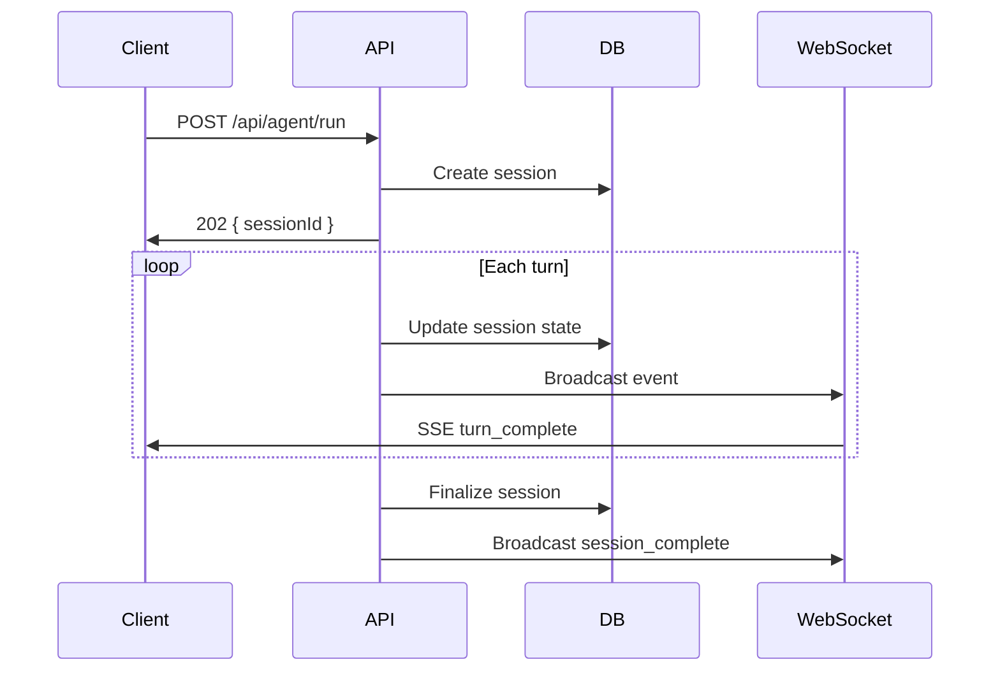
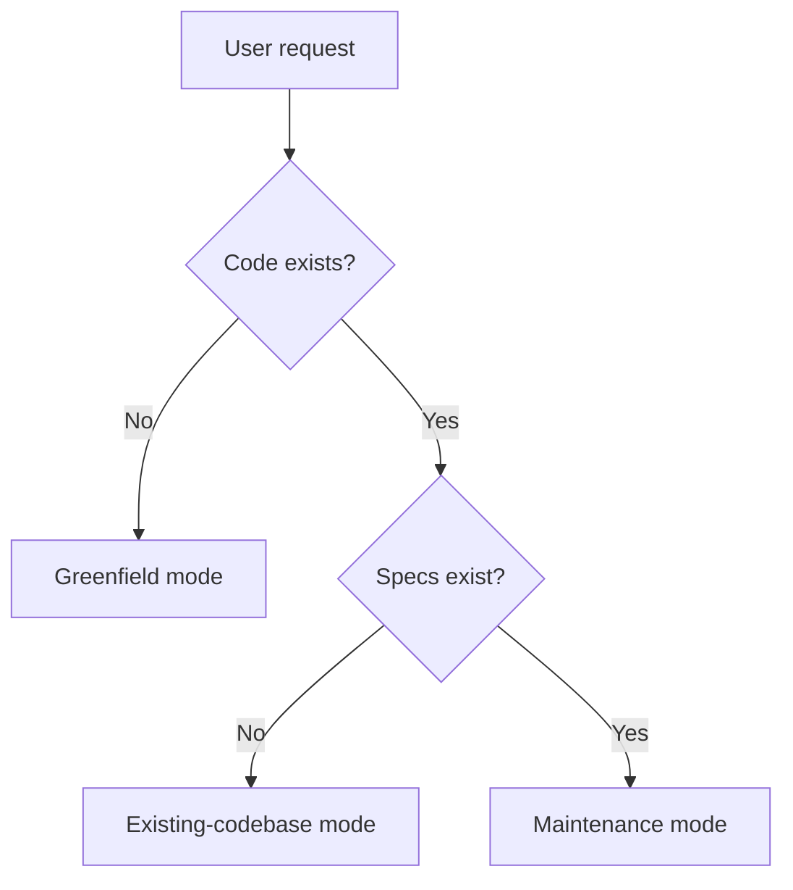
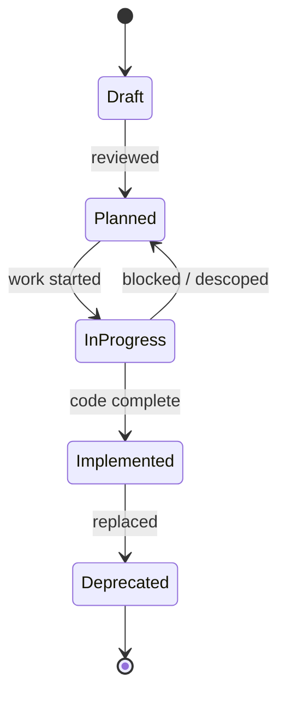
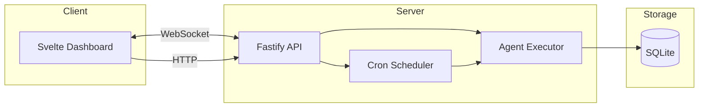

# Spec-Anchored Development

Specifications are living system maps, not static documentation. Every spec maintains a bidirectional graph with implementing code: spec to code for execution, code to spec for comprehension.

## When to Use

- Starting a new system and want a spec that guides implementation (**greenfield mode**).
- Joining an existing codebase with partial or missing specs and need to reverse-engineer a system map (**existing-codebase mode**).
- A system is evolving and its spec needs to stay in sync with the code (**maintenance mode**).
- The user mentions specs, spec-to-code graph, system architecture, or needs to document non-obvious design decisions.
- Working in Python, Go, or TypeScript — language-specific guidance is provided.

## When NOT to Use

- The user wants a one-off README or API reference, not a spec-anchored system map. Use a lighter tool.
- The task is a single bug fix or refactor that doesn't cross system boundaries. A spec is overhead here.
- The codebase uses a language not covered (Rust, Java, Ruby, etc.). The general principles transfer, but the language-specific references won't apply — flag this to the user before proceeding.
- The user explicitly wants pseudocode or informal design notes. This skill enforces language-native types and formal structure.

## Core principles

- Every feature is a **System** — a module with boundaries, inputs, outputs, and state.
- **Specs** define what and why (intent, invariants, interfaces). **Plans** define how and when (phases, tasks, verification). Keep them separate unless scope is trivially small.
- The bidirectional graph is the core invariant: specs point to code via code map tables, and code points back to specs via `Spec:` comments. Both directions are required — creating one without the other is incomplete work.
- Write language-native types in specs, not pseudocode.
- Use Mermaid diagrams liberally to clarify how systems and components interact. They're version-controllable, render natively in GitHub/GitLab, and stay readable as text.

## Diagrams

Use diagrams whenever they clarify relationships, flow, or behavior that prose alone would obscure. Pick the diagram type that matches what you're explaining:

**Sequence diagrams** — show how components interact over time. Use for API flows, multi-step workflows, and request lifecycles.



**Flowcharts** — show decision logic, branching paths, and process flows. Use for request routing, error handling, and mode selection.



**State diagrams** — show entity lifecycles and allowed transitions. Use for any entity with a status field or workflow stages.



**Component / topology diagrams** — show system boundaries, data flow between services, and deployment topology. Use for architecture overviews and subsystem relationships.



**When to include a diagram:** If a spec section describes interactions between two or more components, a multi-step process, or an entity with state transitions, add a diagram. A diagram should appear in most Architecture, Workflow, and State Machine sections.

## Workflow

1. Identify the mode.
2. Identify the primary language.
3. Read the matching mode reference.
4. Read the matching language reference.
5. Inspect the repository structure before drafting or editing specs.
6. Produce or update specs with explicit status, scope, ownership, and traceability.

## Mode selection

- **Greenfield** — [greenfield mode](./references/greenfield.md): Little or no code exists. Goal is an initial system map plus starter specs.
- **Existing codebase** — [existing-codebase mode](./references/existing-codebase.md): Code exists but specs are partial or missing. Discovery is Socratic.
- **Maintenance** — [maintenance mode](./references/maintenance.md): Both exist. Keep the graph current as the system evolves.

When ambiguous, ask.

## Language selection

- **Python**: [python guidance](./references/python.md)
- **Go**: [go guidance](./references/golang.md)
- **TypeScript**: [typescript guidance](./references/typescript.md)

## Spec hierarchy

| Level | Scope | Example |
|---|---|---|
| **Application** | Cross-cutting architecture, global invariants | `architecture.md` |
| **System** | Cohesive subsystem with APIs, data, and state | `auth-system.md` |
| **Feature** | Narrow capability, single endpoint or behavior | `retry-strategy.md` |
| **Plan** | Phased implementation checklist for a system spec | `auth-plan.md` |

If a topic spans multiple packages or introduces new entities, it's system-level. If it defines one endpoint or behavior, it's feature-level.

## Output rules

Every durable spec includes:

- Status, version, last updated date
- Purpose, goals, and non-goals
- Architecture and ownership boundaries
- Core entities in language-native form
- Workflows and state transitions where relevant
- External surfaces (HTTP, CLI, RPC, events, library)
- Spec-to-code mapping table
- Code-to-spec `Spec:` comments added to implementing files (see back-link format below)

## Quality checklist

Run before finalizing any spec:

- [ ] Goals are quantified, not vague ("fast" → "P99 < 100ms")
- [ ] Non-goals explicitly listed
- [ ] Every entity uses language-native types, not pseudocode
- [ ] Every entity is referenced — no orphans
- [ ] State machines have complete transition diagrams
- [ ] Concrete examples for non-obvious behaviors
- [ ] Code map links every spec section to implementing files (spec → code)
- [ ] Implementing files have `Spec:` comments linking back (code → spec)
- [ ] Naming, API paths, and error handling match existing codebase patterns
- [ ] Metadata present (status, version, date)

## Anti-patterns

| Anti-Pattern | Signal | Fix |
|---|---|---|
| God spec | One spec covers auth, storage, API, scheduling, notifications | Split by domain — each system with its own data model gets its own spec |
| Micro spec | Separate specs for "create endpoint" and "list endpoint" on the same resource | Merge into one system or feature spec per cohesive domain |
| Directory-driven breakdown | Specs mirror folder structure rather than domain boundaries | Group by what changes together, not where files live |
| Implementation in spec | Spec describes algorithms and internal logic instead of interfaces | Specs own the *what* and *why*; code owns the *how* |
| Spec as snapshot | Written once, never updated, drifts immediately | Use status tracking + maintenance mode |
| Missing boundaries | Spec describes what's in scope but not what's out | Explicit non-goals prevent scope creep and set reader expectations |

## Code-to-spec back-link format

Every significant code file must reference its governing spec. Use a `Spec:` comment with a relative path, optional section anchor, and optional description.

**Format:** `// Spec: <path>[#section] [— description]`

**Simple** — file implements the full spec:
```
// Spec: specs/agent-system.md
```

**Scoped** — file implements a specific section:
```
// Spec: specs/agent-system.md#5-api — Run and cancel endpoints only; scheduling is in scheduler.ts
```

**Exclusion** — clarifies what this file does *not* cover:
```
// Spec: specs/agent-system.md#3-core-entities — Session model; does not include the briefing entity
```

**Intent** — captures a design constraint not obvious from the code:
```
// Spec: specs/agent-system.md#4-workflows — Subagent delegation is depth-limited to 3
```

**Multiple specs** — file sits at a seam between systems:
```
// Spec: specs/agent-system.md#4-workflows — Orchestrates agent runs
// Spec: specs/scheduler-system.md#3-cron — Cron trigger integration
```

**Placement:** At the top of the file after imports. Use inline placement next to a specific type or function only when a single file spans multiple specs and file-level comments would be ambiguous.

**Extraction:** `grep -rn "^// Spec:" src/` returns every back-link in the codebase.

Adapt the comment prefix for the language (`#` for Python, `//` for Go/TypeScript/JavaScript).

## Guardrails

- Do not invent current behavior when the codebase can be inspected.
- Distinguish observed state from target design from open questions.
- Keep non-goals explicit to control scope.
- Prefer one cohesive spec per domain over a single giant design document.
- If implementation contradicts the spec, record the delta instead of silently smoothing it over.
