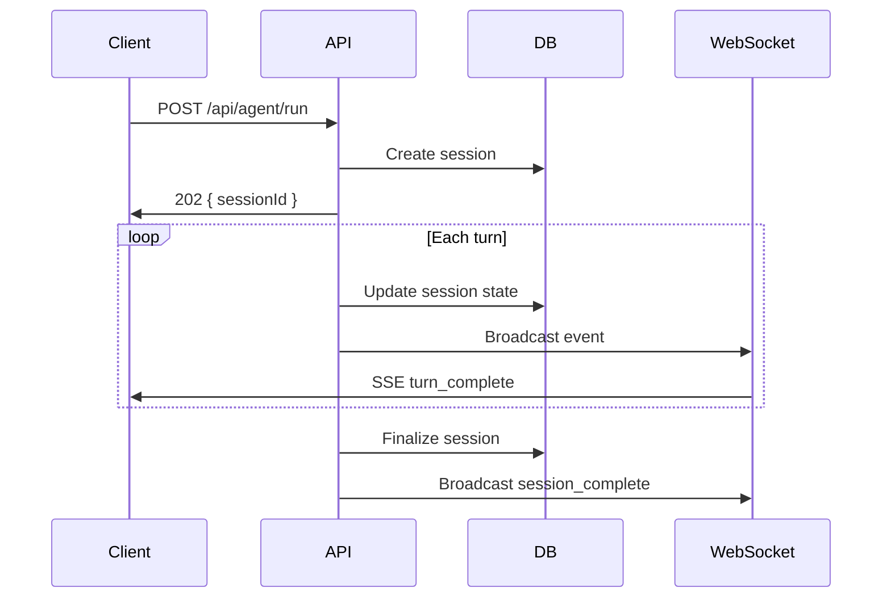
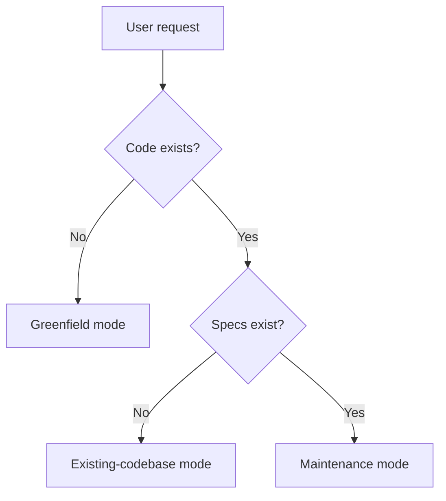
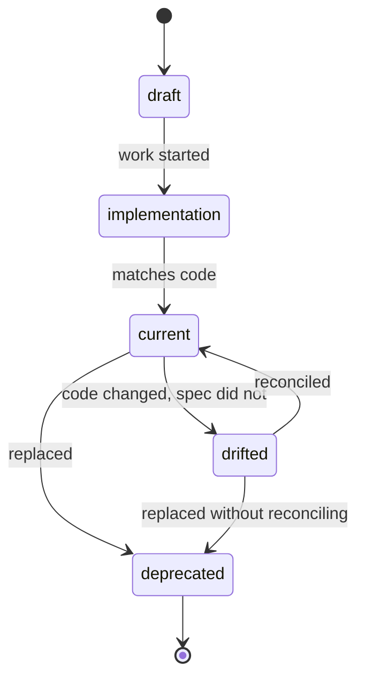
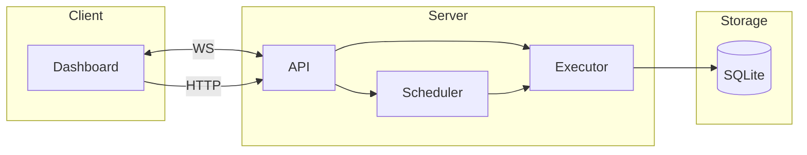

# Spec-Anchored Development

Specifications are living system maps, not static documentation. Every spec maintains a bidirectional graph with implementing code: spec to code for execution, code to spec for comprehension.

## When to Use

- The user asks to author a new spec, formalize a system's design, or bootstrap a system map for an existing codebase.
- The user wants to derive specs from existing code (brownfield / reverse-engineering) and have them stay synced.
- The user is editing code or specs in a project that already uses spec-anchored development and wants the bidirectional graph kept current.
- The user mentions "spec drift", "spec:code graph", "system map", "greenfield spec", "brownfield spec", or asks to audit a project's specs against its code.
- The project is in Python, Go, or TypeScript — the language references in this skill cover those three.

## When NOT to Use

- The user wants a one-off design doc, README, or ADR with no ongoing maintenance contract — this skill assumes a maintained spec/code graph and adds friction otherwise.
- The user wants pure interface documentation (OpenAPI, protobuf, JSON Schema) — those are interface specs, not system specs, and have their own tooling.
- The user wants a project-management plan, milestone roadmap, or sprint breakdown — use a planning skill; specs own the *what* and *why*, not the *when*.
- The user wants implementation-level pseudocode or algorithm walkthroughs — code owns the *how*; this skill explicitly pushes back on implementation in specs.
- The project is in a language other than Python, Go, or TypeScript — the language-specific guidance does not yet cover other ecosystems, and harness-neutral parts won't be enough on their own.

## Optimization targets

A spec system earns its keep by improving three things. Every rule below ladders up to one of them:

1. **Fast navigation** — find the file from the spec, find the spec from the file, in one hop.
2. **Unambiguous intent** — the *why*, the invariants, and the deliberate non-goals are explicit so editors don't violate them by accident.
3. **Low-drift change workflow** — divergence between code and spec is detectable, not silent; updating one without the other is friction, not the default.

## Core principles

- Every feature is a **System** — a module with boundaries, inputs, outputs, and state.
- **Specs** define what and why (intent, invariants, interfaces). **Plans** define how and when (phases, tasks, verification). Keep them separate unless scope is trivially small.
- The bidirectional graph is the core invariant: specs point to code via code map tables, and code points back to specs via `Spec:` comments. **Both directions are required** — work that produces only one half is incomplete and must not be reported as done.
- Write language-native types in specs. When implementing code exists, paste the real type from source rather than paraphrasing. When the spec is `draft` (no implementing code yet), write the canonical type that code will be expected to match — and replace with the pasted source form once code lands.
- Use Mermaid diagrams whenever they clarify relationships, flow, or behavior that prose alone would obscure.
- Prefer stable anchors (spec ids, section ids, symbol names) over volatile ones (line numbers). Line numbers may augment a symbol anchor but should not stand alone.

## Workflow

1. Identify the mode (greenfield / existing-codebase / maintenance). When ambiguous, ask.
2. Identify the primary language.
3. Read the matching mode and language references.
4. Inspect the repository structure before drafting or editing specs.
5. Produce or update specs with locked frontmatter, the required sections, and bidirectional links.
6. Run the completion gates before reporting done.

## Mode selection

- **Greenfield** — [greenfield mode](./references/greenfield.md): Little or no code exists. Goal is an initial system map plus starter specs, derived from Socratic elicitation.
- **Existing codebase** — [existing-codebase mode](./references/existing-codebase.md): Code exists but specs are partial or missing. Survey first, then interview, then draft.
- **Maintenance** — [maintenance mode](./references/maintenance.md): Both exist. Keep the graph current. Operates from a code diff, not a clean slate.

## Language selection

- **Python**: [python guidance](./references/python.md)
- **Go**: [go guidance](./references/golang.md)
- **TypeScript**: [typescript guidance](./references/typescript.md)

## Spec hierarchy

| Level | Scope | Example |
|---|---|---|
| **Application** | Cross-cutting architecture, global invariants | `architecture.md` |
| **System** | Cohesive subsystem with APIs, data, and state | `auth-system.md` |
| **Cross-cutting** | A concept several systems share but none owns (event model, identity scheme, naming) | `event-model.md` |
| **Feature** | Narrow capability, single endpoint or behavior | `retry-strategy.md` |
| **Plan** | Phased implementation checklist for a system spec | `auth-plan.md` |

If a topic spans multiple packages or introduces new entities, it's system-level. Reserve cross-cutting specs for concepts genuinely shared across systems — use them sparingly, not as a dumping ground for "miscellaneous."

## Spec frontmatter

Every spec begins with YAML frontmatter. The schema is locked so tooling and back-links can resolve specs by stable id rather than filename.

```yaml
---
spec: agent-executor              # stable id, used by back-links and the index
title: Agent Executor
status: current                   # see status enum below
version: 1.2
last_updated: 2026-04-14
level: system                     # application | system | cross-cutting | feature | plan
owners:                           # primary code paths this spec governs
  - server/src/agent/executor.ts
  - server/src/agent/usage.ts
adjacent:                         # related specs, by id
  - agent-tools
  - lifecycle-hooks
  - scheduler
tests:                            # primary verification anchors
  - server/src/agent/executor.test.ts
---
```

Rules:

- `spec` is the stable id. Back-links and the spec index resolve by id, not filename, so spec files can be renamed without breaking the graph.
- `owners` lists *primary* implementing files. Most files appear under exactly one spec's `owners`. **Seam files** — plugin bootstrap, route registration, shared event normalization, schemas spanning multiple domains — may legitimately appear under several specs' `owners` lists. When they do, every owning spec must list the file, and the file's `// Spec:` comments must use the multi-link form with scope qualifiers so it is unambiguous which sections (or which symbols) belong to which spec.
- `adjacent` declares known coupling. Used to rank impact when one spec changes.
- `last_updated` must be bumped on any substantive change. The maintenance audit flags specs whose `last_updated` falls behind the most recent commit on any `owners` file.

## Status enum

Status is a single field with five allowed values. Pick the one that describes the spec's relationship to current code, not the spec's editorial polish.

| Status | Meaning | Editor action |
|---|---|---|
| `draft` | Spec written, no implementation yet. Freely editable. | Implement against this; bump to `implementation` when work starts. |
| `implementation` | Code is being built against the spec; partial. | Treat the spec as the target. Update both as you go. |
| `current` | Code matches spec; both maintained. | Default working state. Edits to either require updating the other. |
| `drifted` | Spec was current; code has moved on without spec updates. | Reconcile before extending. New code referencing this spec should not be merged until cleared. |
| `deprecated` | Do not extend. Kept for historical context or until removal. | New code must not depend on this spec; back-links from new code fail the lint. |

The forward path is `draft → implementation → current`. `drifted` is set by the maintenance audit when a `current` spec's owners diverge. `deprecated` is sticky.

## Required sections

Every system or cross-cutting spec includes these sections, in this order. Feature specs may collapse 4–6 if scope is trivial. Plans use a different template (see greenfield reference).

1. **Why** — Why this system exists. The problem it solves, the constraint or incident that motivated it, and **what would be easy to break by accident** if you edit blindly. This is the section a code reader cannot derive themselves; without it the spec adds no marginal value.
2. **Goals & non-goals** — Quantified goals ("P99 < 100ms"), explicit non-goals with brief reasons (deferred features, alternatives deliberately rejected).
3. **Invariants** — Properties that must always hold. Concrete and falsifiable. Examples: "subagent depth ≤ 3", "session.status only transitions forward", "workspace ids are never reused".
4. **Tradeoffs & rejected alternatives** — Decisions made, alternatives considered, why chosen. Three lines per decision is enough; the goal is preventing future re-litigation.
5. **Core entities** — Type definitions in the project's language. For `current`, `drifted`, or `implementation` specs with code on disk, **paste from the codebase** (do not paraphrase). For `draft` specs with no implementation yet, write the canonical type the code will be expected to match. Cross-link entities defined in other specs rather than redefining.
6. **Workflows & state machines** — Sequence and state diagrams for any multi-step or stateful behavior. Mermaid only.
7. **External surfaces** — HTTP routes, CLI commands, RPC, events, library exports. Include request/response shapes for HTTP.
8. **Failure modes** — What can break, what the response is, what is logged or escalated.
9. **Edit impact** — Concrete checklist: "If you change X, also inspect Y, Z, W." See template below. **Generic advice is not allowed.** Required for specs with status `current`, `drifted`, or `deprecated` that span more than one owning module. Single-module specs and specs with status `draft` or `implementation` may use the explicit placeholder `_(none yet — populate when the system grows or status reaches current)_`; real content is required before a multi-module spec can reach `current`.
10. **Code map** — Spec section → implementing files, with key symbols where helpful.
11. **Test map** — Spec section → primary tests.
12. **Known deltas** — Tracked divergences between spec and code, each with reason and owner. Empty for `current` specs; populated when status is `drifted`.
13. **Open questions** — Anything unsettled. The first place to check before proposing changes.

### Edit impact template

```markdown
## Edit impact

- **If you change session status values:** also inspect `data-layer.md` (schema), `dashboard.md#3-types` (frontend types), `api-websocket.md#5-events` (event normalization), and the lifecycle/route tests under `server/src/routes/agent.test.ts`.
- **If you change tool registration:** also inspect `agent-tools.md#3-tool-assembly`, `lifecycle-hooks.md#5-registered-hooks`, the agent config schema in `config-and-loading.md`, and the available-tools docs in `dashboard.md`.
```

The format is deliberate: name a *concrete* change, list the *concrete* files and sections to inspect. "Update related docs" does not count.

## Code-to-spec back-link format

Every owning code file references its governing spec via a `Spec:` comment using the spec id, optional section anchor, and optional scope/intent note.

**Format:** `// Spec: <spec-id>[#section] [— description]`

The `<spec-id>` is the `spec:` field from the target spec's frontmatter, **not** a filename. This survives spec renames.

**Simple** — file implements the full spec:
```
// Spec: agent-executor
```

**Scoped** — file implements only part. **Section anchor is mandatory** when scope is partial:
```
// Spec: agent-executor#5-model-resolution — Provider/model resolution and custom model lookup
```

**Intent** — captures a constraint not obvious from the code:
```
// Spec: agent-executor#6-subagent-spawning — Depth-limited to 3; do not raise without revising the spec
```

**Multiple specs (seam files only)** — file truly sits between systems. Each line carries a scope qualifier so it is unambiguous which lines or symbols belong to which spec:
```
// Spec: agent-executor#3-execution-flow — Run loop and bounds enforcement
// Spec: scheduler#4-trigger-resume — Cron resume path only (function: resumeFromCron)
```

Use multi-link sparingly. Most files belong to exactly one spec.

**Required for:** core modules, route files, stateful services, schema/storage files, major UI state modules, primary entry points. Trivial utility files do not need back-links.

**Placement:** At the top of the file, after imports. Inline placement next to a specific symbol is allowed only when a single file spans multiple specs and file-level comments would be ambiguous.

**Extraction (language-agnostic):** `grep -rEn '^(// |# )Spec:' src/` (or `rg -n '^(//|#) Spec:' src/`) returns every back-link in the codebase regardless of language. The pattern handles both `//` (TS/JS/Go) and `#` (Python) prefixes.

Adapt the comment prefix for the language (`#` for Python, `//` for Go/TypeScript/JavaScript).

## Spec index

A `SPEC_INDEX.md` at the spec root is mandatory. It is the cold-start entry point for any reader and the single source of truth for "what systems exist." It is generated from spec frontmatter; do not maintain it by hand.

Required columns:

| Column | Source |
|---|---|
| Spec | `title` (linked to the spec file) |
| Id | `spec` |
| Level | `level` |
| Status | `status` |
| Owning code paths | `owners` |
| Adjacent | `adjacent` |
| Purpose | First sentence of the Why section |

Include a topology Mermaid showing how systems connect. The index is the right place for the system-of-systems view that no individual spec owns.

## Conventions file

On first run in a repo, write `specs/CONVENTIONS.md` to the target. It contains: the frontmatter schema, the status enum, the back-link format, and the required-sections list — distilled from this skill. Its purpose is to keep the format reproducible by future PRs even when this skill is not loaded.

## Diagrams

Use Mermaid because diagrams are version-controllable, render natively in GitHub/GitLab, and stay readable as text. Pick the diagram type that matches what you're explaining:

**Sequence diagrams** — how components interact over time. Use for API flows, multi-step workflows, request lifecycles.



**Flowcharts** — decision logic, branching paths, process flows. Use for request routing, error handling, mode selection.



**State diagrams** — entity lifecycles and allowed transitions. Use for any entity with a status field. The spec status enum itself is a good example:



**Component / topology diagrams** — system boundaries, data flow, deployment. Use for architecture overviews and the spec index.



**When to include a diagram:** If a section describes interactions between two or more components, a multi-step process, or an entity with state transitions, add one. Architecture, Workflow, and State Machine sections almost always need a diagram.

## Quality checklist

Run before finalizing any spec:

- [ ] Frontmatter present with all required fields; `status` is from the enum
- [ ] Why section explains motivation and "what's easy to break by accident"
- [ ] Goals are quantified, not vague ("fast" → "P99 < 100ms")
- [ ] Non-goals listed with brief reasons
- [ ] Invariants section present and concrete
- [ ] Tradeoffs section names rejected alternatives
- [ ] Every entity uses language-native types: pasted from source for `current`/`drifted`/`implementation` specs, canonical declarations for `draft` specs
- [ ] Entities defined in other specs are linked, not redefined
- [ ] State machines have complete transition diagrams
- [ ] Edit-impact section names concrete files and sections (not "related docs")
- [ ] Code map links every spec section to implementing files, with symbols where helpful
- [ ] Test map links every section to primary tests
- [ ] Owning files have `// Spec:` comments using the spec id (code → spec)
- [ ] Section anchors used in back-links whenever scope is partial
- [ ] Multi-link only on true seam files, with scope qualifiers
- [ ] Known deltas populated if status is `drifted`; empty otherwise
- [ ] Naming, API paths, and error handling match existing codebase patterns

## Completion gates

The skill must not report a run as done until all of these pass. These are hard gates, not preferences. They exist because the skill's biggest historical failure mode is producing one half of the graph and stopping.

1. **Both directions exist.** `grep -rEn '^(// |# )Spec:' <code-root>` (or `rg -n '^(//|#) Spec:' <code-root>`) returns at least one match per touched spec whose status is `implementation`, `current`, `drifted`, or `deprecated`. `draft` specs are exempt because their code does not exist yet. If a non-`draft` spec has zero back-links, write them before reporting done.
2. **Frontmatter is valid.** Every spec touched in this run has the locked schema and a value from the status enum.
3. **Required sections are present.** Why, Invariants, and Tradeoffs have real content for every spec. Edit Impact has real content for any spec that is `current`, `drifted`, or `deprecated` *and* has more than one owning module; the placeholder form is acceptable for `draft`/`implementation` specs and single-module specs.
4. **Spec index updated.** `SPEC_INDEX.md` reflects new/changed specs.
5. **Conventions file present.** `specs/CONVENTIONS.md` exists.
6. **Drift report run.** The drift checks listed in the maintenance reference pass, or the failures are surfaced in the run summary with remediation steps.

If any gate fails, fix it or surface it explicitly. Do not silently ship a half-graph.

## Anti-patterns

| Anti-Pattern | Signal | Fix |
|---|---|---|
| God spec | One spec covers auth, storage, API, scheduling, notifications | Split by domain — each system with its own data model gets its own spec |
| Micro spec | Separate specs for "create endpoint" and "list endpoint" on the same resource | Merge into one cohesive system or feature spec |
| Directory-driven breakdown | Specs mirror folder structure rather than domain boundaries | Group by what changes together, not where files live |
| Implementation in spec | Spec describes algorithms and internal logic instead of interfaces | Specs own the *what* and *why*; code owns the *how* |
| Spec as snapshot | Written once, never updated, drifts immediately | Status tracking + maintenance mode + drift checks |
| Missing boundaries | Spec describes what's in scope but not what's out | Explicit non-goals with reasons |
| Generic edit-impact | "Be careful when editing this" | Name the concrete files and sections to inspect |
| Back-link spam | Every utility file has back-links, often to multiple specs | Restrict to core/route/stateful/schema/UI-state files; prefer single-link |
| Pseudocode entities | A spec with implementing code defines a stylized type that does not match source | For specs with code on disk, paste the real type. For `draft` specs the canonical declaration is allowed; replace it with the pasted form once code lands |
| Filename back-links | `// Spec: specs/agent-executor.md` | Use the spec id: `// Spec: agent-executor` |
| Why-as-summary | Why section restates what the code does | Replace with the constraint, incident, or product reason that motivated the system |

## Guardrails

- Do not invent current behavior when the codebase can be inspected.
- Distinguish observed state from target design. Use Known deltas and Open questions, not body prose, to flag uncertainty.
- Keep non-goals explicit to control scope.
- Prefer one cohesive spec per domain over a single giant design document.
- If implementation contradicts the spec, set status to `drifted` and record the delta. Do not silently smooth it over.
- Never declare a run done with the back-link gate failing. The skill exists specifically to prevent that regression.
